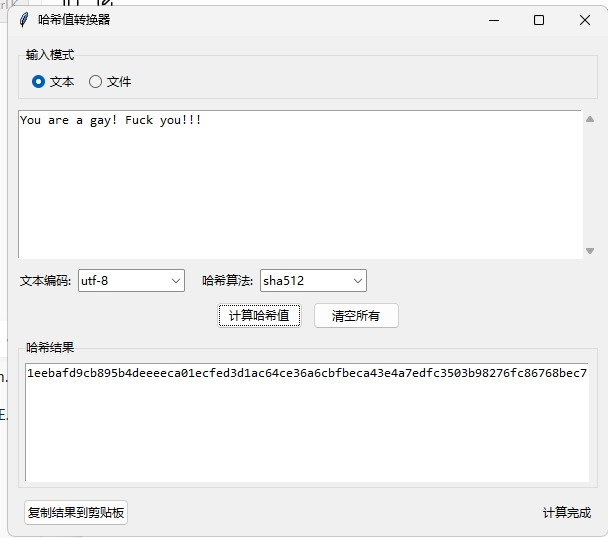

# HashBaseTool
本地哈希计算 & Base64 编码解码工具 | Windows 平台

## ✨ 功能特性
✅ Base64 编码 / 解码
✅ 文本哈希：MD5、SHA1、SHA256、SHA512
✅ 文件哈希校验（校验文件是否被篡改）
✅ 一键复制结果
✅ 所有运算**本地执行**，不会上传数据，保护隐私
✅ Python开发，打包独立EXE，双击直接运行，无需安装Python环境

## 🎯 适用人群
开发者、运维、需要经常进行编码转换、文件校验的用户

## 📸 程序演示
<p align="center">
  
</p>

## 📥 快速使用
前往 [Releases](https://github.com/Joey9178/HashBaseTool/releases) 下载打包好的独立 EXE，直接打开运行。

## 💡 为什么选择本工具？
市面上很多在线哈希、Base64网站，输入敏感内容有泄露风险。
本工具全部逻辑本地运行，不上传任何文字、文件，安全省心。

## 🛠️ 源码运行（开发者）
```bash
# 克隆项目
git clone https://github.com/你的用户名/仓库名.git
cd 仓库文件夹
# 安装依赖
pip install -r requirements.txt
# 启动程序
python main.py
##给我star的是帅哥美女！！！！！！！！！！！！🙏🙏🙏
